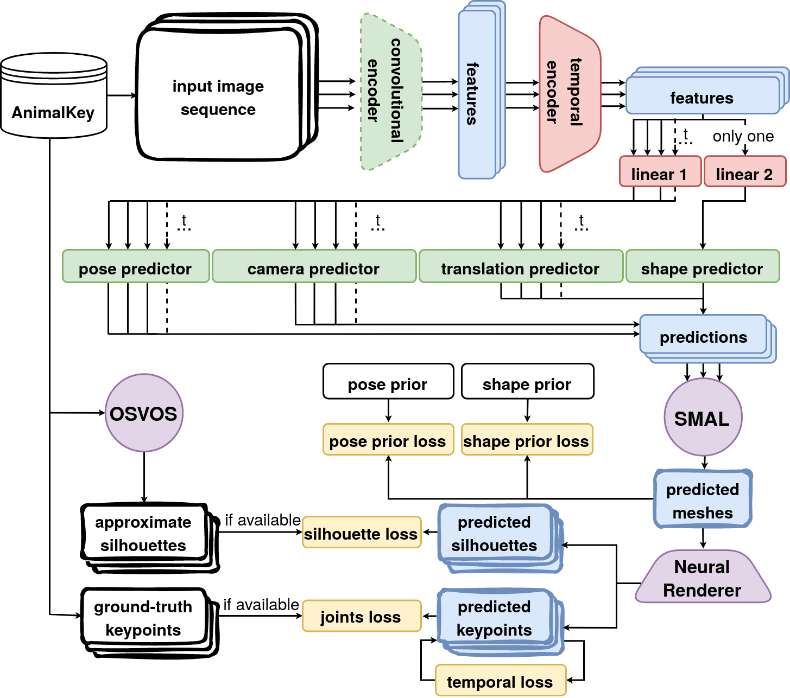
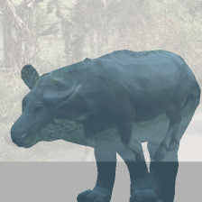
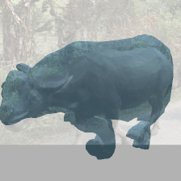

# SMAL4V (SMAL for Videos)

This repository contains research done as part of the diploma thesis, which will be available for download at https://dspace.cvut.cz/ after the defence. The installation instruction and example results follow.

All the code from this repository is free to use if the original source is cited. Note that it has some dependences that are protected by different licences, including *SMAL (A Skinned Multi-Animal Linear Model of 3D Animal Shape)*. Consult https://smal.is.tue.mpg.de/license.html for the information on *SMAL* licensing.

This research ows a lot to the following works:

* [[model](https://smal.is.tue.mpg.de/)|[paper](https://files.is.tue.mpg.de/black/papers/smal_cvpr_2017.pdf)] *3D Menagerie: Modeling the 3D Shape and Pose of Animals* 
* [[code](https://github.com/benjiebob/WLDO)|[paper](https://arxiv.org/abs/2007.11110)] *Who Left the Dogs Out? 3D Animal Reconstruction with Expectation Maximization in the Loop* 
* [[code](https://github.com/silviazuffi/smalst)]|[paper](https://ps.is.mpg.de/uploads_file/attachment/attachment/533/6034_after_pdfexpress.pdf)] *Three-D Safari: Learning to Estimate Zebra Pose, Shape, and Texture from Images "In the Wild"* 

## Description of the Approach

### Architecture

The arhitecute of the neural network, used for the online learning, is shown in the image below. More information will be available once the diploma thesis is officially released by the university. The link will be added to this description.

### Results 

Below are shown some first results, achieved on the *AnimalKey* dataset (video sequences 295, 301 and 306 are randomly chosen for the demonstration purposes).

* Results of the **base network**, i.e. the WLDO pipeline trained on *StanfordExtra* with no fine-tuning on *AnimalKey*.

* Results of the **parent network**, i.e. the WLDO pipeline, fine-tuned on the annotated frames from *AnimalKey* without incorporating any temporal information.

* Results of tthe **test network**, i.e. the SMAL4V pipeline, trained on a single video with sparse annotations. 

Note that the performance of the non-temporal pipeline fine-tuned the same data, is even less stable. (**TO BE ADDED FOR DEMONSTRATION**)

Still, current results suffer a lot from the insufficient training data from  *AnimalKey*, making the networks predictions non-smooth despite training with the temporal losses. Most likelely, a more powerful parent network is required, which would pre-train the RNN encoder on more temporal sequences. 

Want to help and collaborate on [AnimalKey](https://github.com/iegorval/animalkey) dataset? **Let me know!**

## Installation Instructions

**NOTE THAT SMALL UPDATES ARE BEING MADE TO THE REPO -> WAIT BEFORE INSTALLING**

To install *SMAL4V*, folow the steps described below. If you find any of them not reproducable, please open an issue on github or contact me at iegorval@gmail.com. Note that all the instructions below are tested only on Ubuntu and you would probably need some version of Linux to run the project.

0. Make sure you have correctly installed CUDA as described at https://docs.nvidia.com/cuda/cuda-installation-guide-linux/index.html.

1. Install conda environment from `environment.yml` and activate it:
    * `conda env create -f environment.yml`
    * `conda activate smal4v`

2. Install PyTorch with CUDA support. Note that the command below corresponds to the CUDA v11.1. In case you have different CUDA versions, consult https://pytorch.org/get-started/locally/. 
    * `pip3 install torch==1.8.1+cu111 torchvision==0.9.1+cu111 torchaudio==0.8.1 -f https://download.pytorch.org/whl/lts/1.8/torch_lts.html`

3. Install a PyTorch version of *Neural 3D Mesh Renderer*. Note that (as of time of writing) `pip` installation fails with this package. Also, you should change all `AT_CHECK` to `AT_ASSERT` in  `.cpp` files in `neural_renderer/cuda/` folder to be able to install it.
    *  `cd external`
    * `git clone https://github.com/daniilidis-group/neural_renderer` 
    * `cd neural_renderer`
    * `python setup.py install` 

4. Download the [SMPL model](https://ps.is.mpg.de/code/smpl/) and move its `smpl_webuser` directory to the SMAL4V's project root.

5. Download the `smpl_models` directory from another SMAL-related project (eg. from [SMALST](https://github.com/silviazuffi/smalst/tree/master/smpl_models)) and place it to the SMAL4V's project root. 

6. Download the data you want to use with the SMALST/WLDO/SMAL4V pipeline:
    * [StanfordExtra](https://github.com/benjiebob/StanfordExtra) or [GrevyZebra](https://github.com/silviazuffi/smalst) if you want to test mesh predictors on single-frame data with ground-truth silhouettes and 2D keypoints.
    * [AnimalKey](https://github.com/iegorval/animalkey) if you want videos with sparse silhouettes and keypoints supervision.
    * [TigDog](http://calvin-vision.net/datasets/tigdog/) or [BADJA](https://github.com/benjiebob/BADJA) if you want videos with dense keypoints supervision.

7. Download the pre-trained models:

    * [SMALST](https://github.com/silviazuffi/smalst) trained on the synthetic zebras dataset with 3D superivison.
    * [WLDO](https://github.com/benjiebob/WLDO/) trained on the real-world *StanfordExtra* dataset with 2D supervision.
    * *soon to be uploaded* - WLDO fine-tuned on the *AnimalKey* dataset.

8. Download the [OSVOS](https://github.com/kmaninis/OSVOS-PyTorch) model to be able densify the silhouette annotations if needed for training.

9. Set the `PYTHONPATH` environment variable to include project root (or configure it in your IDE) and set `LD_LIBRARY_PATH` so that it has access to CUDA.
    * `export PYTHONPATH=[YOUR_PATH_TO_SMAL4V]`
    * `export LD_LIBRARY_PATH=/usr/local/cuda/compat/lib:/usr/local/nvidia/lib:/usr/local/nvidia/lib64:/.singularity.d/libs:/home/*USERNAME*/miniconda3/envs/smalmv/lib`

10. Now, you are ready to use the code base.

    * If you want to test single-frame SMALST/WLDO mesh predictors, use `src/smal_eval.py` with the corresponding configuration files.
    * If you want to fine-tune a single frame mesh predictor on another dataset, use `src/smal_train.py` (currently supports only weak/2D supervision).
    * If you want to train SMAL4V online/test network on a video sequence with sparse supervision, densify the silhouette annotations with OSVOS, and then use `src/smal_train_online.py`.
    * If you want to evaluate a single-frame or multi-frame mesh predictor on a video sequence, use `src/smal_eval_online.py`.
